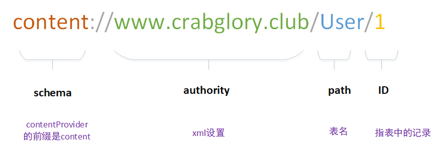

> 文章结构
>
> contentProvider的用法
>
> contentProvider的原理分析
>
> contentProvider衍生的类
>
> contentProvider的注意点


### 原理介绍


ContentResolve 可以通过Context中利用getContentResolve()获取；

获取对象后，通过其方法进行操作，然后底层利用Binder进行通信；

ContentProvider获取参数并进行解析，进行实际的数据操作；

利用context.getContentResolve().notifyChage通知客户端数据发生变化。

具体简单介绍：

<span style="background-color: #F9B6E5; padding:0px 3px; margin:2px; border-radius:3px ">三个主类</span> 

ContentResolve 、 ContentProvider，Binder

- ContentResolve ：用来对数据操作的，同时内部实现了**ContentObserve**，实现对数据变化的监视
- ContentProvider：抽象类，因为数据的类型有很多，ContentProvider将数据统一个接口
- Binder：用来组件之间通信的一个类，可以跨进程。


<span style="background-color: #F9B6E5; padding:0px 3px; margin:2px; border-radius:3px ">通信参数</span> 

- URI：资源定位符

   

- ContentValue：复写了大量的put(key, value)方法，用来储存数据

- Selection：选择数据的哪一行


<span style="background-color: #F9B6E5; padding:0px 3px; margin:2px; border-radius:3px ">操作辅助类</span> 

- Cursor

  用来梳理ContentResolve中query获取的数据集，封装了各种取数据的方式。

- UriMatcher

  配合ContentProvider中getType方法，用addUri来预设需要的URI，在getType中用match来进行适配，返回合适的类型

- ContentUris

  主要是addAppendId和getAppendId，来设置信息。


<span style="background-color: #F9B6E5; padding:0px 3px; margin:2px; border-radius:3px ">数据源</span> 

数据源比较多，凡是可以存储的，都是数据源。

这里需要注意的是SQlite

```java
public class kevinDBHelper extends SQLiteOpenHelper {
    public kevinDBHelper(Context context) {
        super(context, name, null, version);
    }
    @Override
    public void onCreate(SQLiteDatabase db) {}
    @Override
    public void onOpen(SQLiteDatabase db) { super.onOpen(db); }
    @Override
    public void onUpgrade(SQLiteDatabase db, int oldVersion, int newVersion) {}
    @Override
    public void onDowngrade(SQLiteDatabase db, int oldVersion, int newVersion) {
        super.onDowngrade(db, oldVersion, newVersion);
    }
    @Override
    public void onConfigure(SQLiteDatabase db) { super.onConfigure(db); }
}
```

**具体的使用**

```java
// 通过数据库助手创建数据库，并为实际创建，只是记录了参数
mDbHelper = new kevinDBHelper(getContext());
// 拿到数据的句柄进行操作，这里进行了实际创建，同时调用了open方法
db = mDbHelper.getWritableDatabase();
```

- 对象的创建：设置数据库的名字、版本

- onCreate：只会执行一次，一般用来创建表项

- open：但打开数据库进行数据操作的时候使用

- onConfigure：数据库配置发生改变的回调，比如取消外键约束

- onUpgrade，onDowngrade：版本的升级与降级

  特别需要注意的是：<span style="background-color: #C6E2FF; padding:0px 3px; margin:2px; border-radius:3px ">假如客户处于不同版本的数据库，但都要更新到最新的数据库，如何操作？</span> 

  个人想法是：可以按编号进行更新的存储，根据当前版本和最新版本遍历进行更新或者回退操作。


### 具体使用

分为两部分来写，一个是进程内和进程外，采用的数据源是：SQLite

<span style="background-color: #FFD39B; padding:0px 3px; margin:2px; border-radius:3px ">通用的数据源</span> 

```java
public class kevinDBHelper extends SQLiteOpenHelper {

    private static final String name = "KEVIN_DB";
    private static final int version = 1;
    private static final String USER_TABLE_NAME = "USER_TABLE_NAME";
    private static final String JOB_TABLE_NAME = "JOB_TABLE_NAME";

    public kevinDBHelper(Context context) {super(context, name, null, version);}
    
    @Override
    public void onCreate(SQLiteDatabase db) {
        db.execSQL("CREATE TABLE IF NOT EXISTS " 
                   + USER_TABLE_NAME 
                   + "(_id INTEGER PRIMARY KEY AUTOINCREMENT," + " name TEXT)");
        db.execSQL("CREATE TABLE IF NOT EXISTS " 
                   + JOB_TABLE_NAME 
                   + "(_id INTEGER PRIMARY KEY AUTOINCREMENT," + " job TEXT)");
    }
    
    @Override
    public void onOpen(SQLiteDatabase db) {super.onOpen(db);}
    @Override
    public void onConfigure(SQLiteDatabase db) {super.onConfigure(db);}
    @Override
    public void onUpgrade(SQLiteDatabase db, int oldVersion, int newVersion) {}
    @Override
    public void onDowngrade(SQLiteDatabase db, int oldVersion, int newVersion) {
        super.onDowngrade(db, oldVersion, newVersion);
    }

}
```

<span style="background-color: #FFD39B; padding:0px 3px; margin:2px; border-radius:3px ">客户端</span> 

**MainActivity.java**

```java
public class MainActivity extends AppCompatActivity {

    private Uri uri;
    private ContentResolver contentResolver;
    private com.example.kevinleak.codestudy.kevinObserver kevinObserver;
    private Handler handler;

    @SuppressLint("HandlerLeak")
    @Override
    protected void onCreate(Bundle savedInstanceState) {
        super.onCreate(savedInstanceState);
        setContentView(R.layout.activity_main);

        initResolver();
        dealData();
    }
        /**
     * 增删查改
     */
    private void dealData() {
        uri = Uri.parse("content://www.crabglory.club/User");
        ContentValues contentValues = new ContentValues();
        contentValues.put("name", "kk");
        // 插入位置，插入的项与值
        contentResolver.insert(uri, contentValues);
        // uri指定表，"id > 1" 说明那个表
        contentResolver.delete(uri, "id > 1", null);
        // 指定表，指定查的列集
        contentResolver.query(uri, new String[]{"_id","name"}, null,
                              null, ContentResolver.QUERY_ARG_SQL_SORT_ORDER);
        contentResolver.update(uri, contentValues, "id > 1", null);
    }

    
    @SuppressLint("HandlerLeak")
    private void initResolver() {
        uri = Uri.parse("content://www.crabglory.club/User/1");
        contentResolver = getContentResolver();
        handler = new Handler(){
            @Override
            public void handleMessage(Message msg) {
                // 此处用来observer与Activity的通信
            }
        };
        kevinObserver = new kevinObserver(handler);
        contentResolver.registerContentObserver(uri, true, kevinObserver);
    }
    @Override
    protected void onDestroy() {
        super.onDestroy();
        getContentResolver().unregisterContentObserver(kevinObserver);
    }
}
```

**kevinObserver.java**

```java
public class kevinObserver extends ContentObserver {
    public kevinObserver(Handler handler) {
        super(handler);
    }
    @Override
    public void onChange(boolean selfChange) {
        // 收到服务端的改变消息，进行复写父类的方法
    }
}
```

<span style="background-color: #FFD39B; padding:0px 3px; margin:2px; border-radius:3px ">数据端</span> 

涉及到不同的类型，同一个进程，不同的进程

用xml注册来区别：

可以设置contentProvider的权限：

以普通的来说

```xml
<provider
          android:name=".kevinProvider"
          android:authorities="www.crabglory.club"
          android:enabled="true" 
          // 读写权限设置为私密
          android:permission="www.crabglory.PROVIDER"  
          // 细分
          android:readPermisson = "www.crabglory.Read"
          android:writePermisson = "www.crabglory.Write"
          />
```

如果需要获取相关权限，则需要添加

```xml
<permission android:name="www.crabglory.Read" android:protectionLevel="normal"/>
<permission android:name="www.crabglory.Write" android:protectionLevel="normal"/>

<permission android:name="www.crabglory.PROVIDER" android:protectionLevel="normal"/>
```

<span style="background-color: #C6E2FF; padding:0px 3px; margin:2px; border-radius:3px ">进程内通信清单文件</span> 

```xml
<provider
          android:name=".kevinProvider"
          android:authorities="www.crabglory.club"
          android:enabled="true" />
```

<span style="background-color: #C6E2FF; padding:0px 3px; margin:2px; border-radius:3px ">跨进程清单文件</span> 

```xml
<provider
          android:name=".kevinProvider"
          android:authorities="www.crabglory.club"
          android:enabled="true" 
          <!--这里设置可以外放-->
          android:exported="true"/>
```

<span style="background-color: #C6E2FF; padding:0px 3px; margin:2px; border-radius:3px ">ContentProvider</span> 

```java
public class kevinProvider extends ContentProvider {

    private com.example.kevinleak.codestudy.kevinDBHelper kevinDBHelper;
    private SQLiteDatabase db;

    public kevinProvider() { }
    @Override
    public int delete(Uri uri, String selection, String[] selectionArgs) { return 0; }
    @Override
    public String getType(Uri uri) { return null; }
    @Override
    public Uri insert(Uri uri, ContentValues values) { return null; }
    @Override
    public boolean onCreate() {
        kevinDBHelper = new kevinDBHelper(getContext());
        db = kevinDBHelper.getReadableDatabase();
        return true;
    }
    @Override
    public Cursor query(Uri uri, String[] projection, String selection,
                        String[] selectionArgs, String sortOrder) { return null; }
    @Override
    public int update(Uri uri, ContentValues values, String selection,
                      String[] selectionArgs) { return 0; }
}
```

<span style="background-color: #C6E2FF; padding:0px 3px; margin:2px; border-radius:3px ">SQLiteOpenHelper</span> 

```java
public class kevinDBHelper extends SQLiteOpenHelper {

    private static final String name = "KEVIN_DB";
    private static final int version = 1;
    private static final String USER_TABLE_NAME = "USER_TABLE_NAME";
    private static final String JOB_TABLE_NAME = "JOB_TABLE_NAME";

    public kevinDBHelper(Context context) {
        super(context, name, null, version);
    }
    @Override
    public void onCreate(SQLiteDatabase db) {
        db.execSQL("CREATE TABLE IF NOT EXISTS " + USER_TABLE_NAME 
                   + "(_id INTEGER PRIMARY KEY AUTOINCREMENT," + " name TEXT)");
        db.execSQL("CREATE TABLE IF NOT EXISTS " + JOB_TABLE_NAME 
                   + "(_id INTEGER PRIMARY KEY AUTOINCREMENT," + " job TEXT)");
    }
    @Override
    public void onOpen(SQLiteDatabase db) {
        super.onOpen(db);
    }
    @Override
    public void onConfigure(SQLiteDatabase db) {
        super.onConfigure(db);
    }
    @Override
    public void onUpgrade(SQLiteDatabase db, int oldVersion, int newVersion) { }
    @Override
    public void onDowngrade(SQLiteDatabase db, int oldVersion, int newVersion) {
        super.onDowngrade(db, oldVersion, newVersion);
    }
}
```


