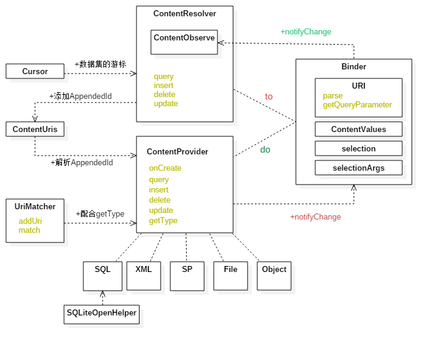

> 文章结构
>
> contentProvider的用法
>
> contentProvider的原理分析
>
> contentProvider衍生的类
>
> contentProvider的注意点

### 原理

### 作用

contentProvider 的作用是为应用提供不同数据的接口，用过contentProvider统一获取资源。

### 使用

URL：contentProvider 用来处理资源定位

ContentUris：解析URI中的id

UriMatcher：根据自己设定的URI，来匹配客户端发来的URI

