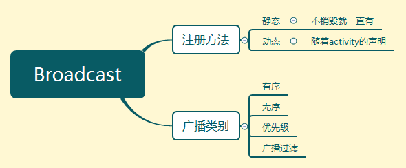
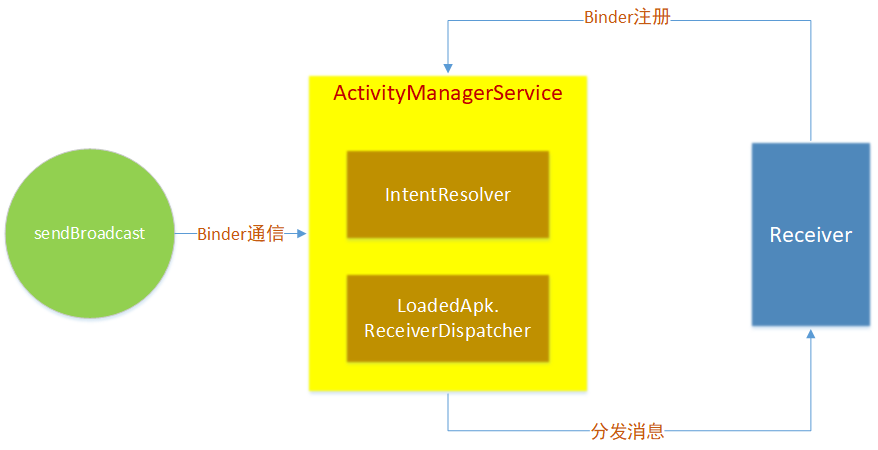
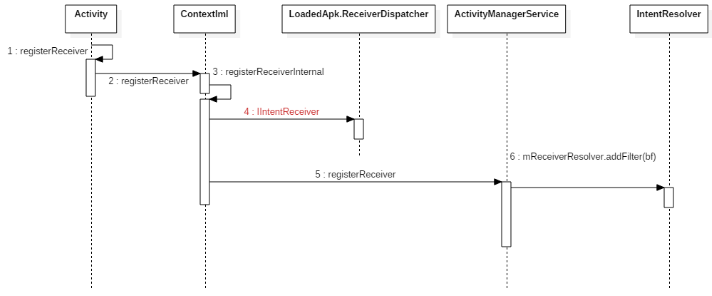
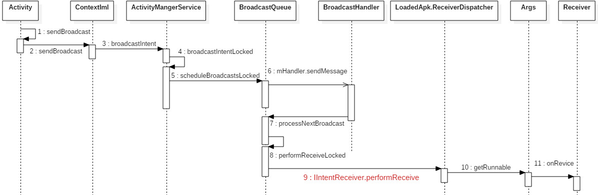

文章结构

> 广播的工作机制
>
> 使用的区别：启动的模式，优先级
>
> 常见子类




Broadcast原理
-------------

其实就是一个订阅者模式



对于一个broadcast，receiver可以有多个。

订阅者模式：

- 订阅者，进行订阅，生成对象，放在一个管理类的容器里面
- 发布者，进行发布，发送消息。
- 分发者，收到消息，根据消息类型，调用对应的receiver的方法，会也有异步操作Handler。

AMS 里面有一个分发者：LoadedApk.ReceiverDispatcher

里面有一个存储订阅者容器：IntentResolver<BroadcastFilter, BroadcastFilter>

通信机制：可跨进程通信的Binder


具体的分析，看下面的源码：

源码分析
--------

### 实验环境

代码构建在android 8 上面，实验代码是Broadcast的自定义。

采取的是动态的注册方式，静态注册xml文件中，在Activity生成实例的时候会完成配置，但是不方便源码分析，所以这里采用动态的方式来研究。

MainActivity.java

```java
Button btnSend = findViewById(R.id.btn_kk);

btnSend.setOnClickListener(new View.OnClickListener() {
	@Override
	public void onClick(View v) {
        // 不断发送消息，如收到系统网络的切换，那么是系统在发送广播
		Intent intent = new Intent("com.example.CustomizeBroadcast");
		sendBroadcast(intent);
	}
});
```

```java
private CustomizeBroadcast broadcast;

@Override
protected void onCreate(Bundle savedInstanceState) {
    super.onCreate(savedInstanceState);
    setContentView(R.layout.activity_main);

    // 实现广播订阅
    IntentFilter intentFilter = new IntentFilter();
    intentFilter.addAction("com.example.CustomizeBroadcast");
    netBroadcast = new CustomizeBroadcast();
    registerReceiver(broadcast, intentFilter);
}


class CustomizeBroadcast extends BroadcastReceiver{
    @Override
    public void onReceive(Context context, Intent intent) {

    }
}

@Override
protected void onDestroy() {
    super.onDestroy();

    unregisterReceiver(broadcast);
}
```

### 源码追踪

#### 订阅

1. 先从`registerReceiver(broadcast, intentFilter); ` 开始

   ```java
   Context mBase;
   
   @Override
   public Intent registerReceiver(
       BroadcastReceiver receiver, IntentFilter filter) {
       return mBase.registerReceiver(receiver, filter);
   }
   ```

   会发现，mBase.registerReceiver没有被实现

2. 找一下ContextImpl.java 

   ```java
   private Intent registerReceiverInternal(BroadcastReceiver receiver, int userId,
                                           IntentFilter filter, 
                                           String broadcastPermission,
                                           Handler scheduler, Context context, int flags) {
       IIntentReceiver rd = null;
       ...
           rd = mPackageInfo.getReceiverDispatcher(receiver, context,scheduler,
                                                   mMainThread.getInstrumentation(), 
                                                   true);
       ...
           rd = new LoadedApk.ReceiverDispatcher(receiver, context, scheduler, 
                                                 null, true).getIIntentReceiver();
       }
   	...
           final Intent intent = ActivityManager.getService().registerReceiver
           (mMainThread.getApplicationThread(), mBasePackageName, rd, filter,
           broadcastPermission, userId, flags);
         
   }
   ```

   可以发现做了两件事:

   - 获取IIntentReceiver，根据命名可以看出IIntentReceiver是一个Binder

     具体的实现操作在 <span style="background-color: #F9B6E5; padding:0px 3px; margin:2px; border-radius:3px ">mPackageInfo.getReceiverDispatcher</span> 和 <span style="background-color: #F9B6E5; padding:0px 3px; margin:2px; border-radius:3px ">LoadedApk.ReceiverDispatcher</span> 

     因为广播可能是对其他应用的广播，而binder机制就是跨进程通信的。

   - 通过AMS 注册 Receiver

3. 在ActivityManagerService 中查看registerReceiver，追踪到

   ```java
   public Intent registerReceiver(IApplicationThread caller, String callerPackage,
                                  IIntentReceiver receiver, IntentFilter filter, 
                                  String permission, int userId,int flags) {
       ...
   
           synchronized (this) {
           ...
               ReceiverList rl = mRegisteredReceivers.get(receiver.asBinder());
           ...
               BroadcastFilter bf = new BroadcastFilter(filter, rl, callerPackage,
                                                        permission, callingUid, userId, 
                                                        instantApp,visibleToInstantApps);
           if (rl.containsFilter(filter)) {
               Slog.w(TAG, "Receiver with filter " + filter
                      + " already registered for pid " + rl.pid
                      + ", callerPackage is " + callerPackage);
           } else {
               rl.add(bf);
               if (!bf.debugCheck()) {
                   Slog.w(TAG, "==> For Dynamic broadcast");
               }
               mReceiverResolver.addFilter(bf);
           }
   
           ...
               return sticky;
       }
   }
   ```

   可想到的是，肯定要把注册的对象进行保存，发现一个成员变量mReceiverResolver，里面存储了broadcast的过滤条件与ReceiverList

4. 查看一下mReceiverResolver变量

   ```java
   /**
   * Resolver for broadcast intents to registered receivers.
   * Holds BroadcastFilter (subclass of IntentFilter).
   */
   final IntentResolver<BroadcastFilter, BroadcastFilter> mReceiverResolver
               = new IntentResolver<BroadcastFilter, BroadcastFilter>() {...};
   ```

   可以看到注释的意思：这是一个承载广播注册意图的接收器

   到这里可以很明确了，这就是注册的整个过程

##### 时序图



#### 广播

1. 先从`sendBroadcast();` 开始

   ```java
   @Override
   public void sendBroadcast(Intent intent) {
       mBase.sendBroadcast(intent);
   }
   ```

   发现同样没有实现

2. 进入ContextImpl.java 中查看sendBroadcast

   ```java
   @Override
   public void sendBroadcast(Intent intent) {
       warnIfCallingFromSystemProcess();
       String resolvedType = intent.resolveTypeIfNeeded(getContentResolver());
       try {
           intent.prepareToLeaveProcess(this);
           // 注意这里
           ActivityManager.getService().broadcastIntent(
               mMainThread.getApplicationThread(), intent, resolvedType, null,
               Activity.RESULT_OK, null, null, null, AppOpsManager.OP_NONE, 
               null, false, false,
               getUserId());
       } catch (RemoteException e) {
           throw e.rethrowFromSystemServer();
       }
   }
   ```

3. AMS

   ```java
   public final int broadcastIntent(IApplicationThread caller,
                                    Intent intent, String resolvedType, 
                                    IIntentReceiver resultTo,
                                    int resultCode, String resultData, 
                                    Bundle resultExtras,
                                    String[] requiredPermissions, int appOp, 
                                    Bundle bOptions,
                                    boolean serialized, boolean sticky, int userId) {
       synchronized(this) {
           intent = verifyBroadcastLocked(intent);
           ...
           int res = broadcastIntentLocked(
               callerApp,callerApp != null ? callerApp.info.packageName : 
               null,intent, resolvedType, resultTo, resultCode, resultData, resultExtras,
                                           requiredPermissions, appOp, bOptions, serialized, sticky, callingPid, callingUid, userId);
           
           Binder.restoreCallingIdentity(origId);
           return res;
       }
   }
   ```

4. 在AMS 中继续查看broadcastIntentLocked，代码有点长，这里

   ```java
   
   @GuardedBy("this")
   final int broadcastIntentLocked(ProcessRecord callerApp,
             String callerPackage, Intent intent, String resolvedType,
             IIntentReceiver resultTo, int resultCode, String resultData,
             Bundle resultExtras, String[] requiredPermissions, int appOp, 
              Bundle bOptions,boolean ordered, boolean sticky, int callingPid, 
                                   int callingUid, int userId) {
       // Instant Apps cannot use FLAG_RECEIVER_VISIBLE_TO_INSTANT_APPS
       ...
       // By default broadcasts do not go to stopped apps.
       ...
       // If we have not finished booting, don't allow this to launch new processes.
       ...
       //确保正在接收此广播的用户或其父级正在运行。
       ...
       //查看是否允许调用者执行此操作。
       ...
       //确认受保护的广播仅由系统代码发送，并且该系统代码仅发送受保护的广播。
           ...
   	//先行安全检查：阻止非系统应用发送受保护的广播。.
           ...
   	// 对action类别过滤，进行处理
       // Add to the sticky list if requested.
           ...
       // Figure out who all will receive this broadcast.
           ...
       // 通过队列进行发送
           ...
           return ActivityManager.BROADCAST_SUCCESS;
   }
   
   ```

5. 在BroadcastQueue看一下通过队列发送的情景queue.scheduleBroadcastsLocked();

   ```java
   public void scheduleBroadcastsLocked() {
       if (mBroadcastsScheduled) {
           return;
       }
       mHandler.sendMessage(mHandler.obtainMessage(BROADCAST_INTENT_MSG, this));
       mBroadcastsScheduled = true;
   }
   ```

6. 在BroadcastQueue搜索BROADCAST_INTENT_MSG，可以看到handle的处理

   ```java
       private final class BroadcastHandler extends Handler {
           public BroadcastHandler(Looper looper) {
               super(looper, null, true);
           }
   
           @Override
           public void handleMessage(Message msg) {
               switch (msg.what) {
                   // 注意看这里，比对上了
                   case BROADCAST_INTENT_MSG: {
                       if (DEBUG_BROADCAST) Slog.v(
                               TAG_BROADCAST, "Received BROADCAST_INTENT_MSG");
                       processNextBroadcast(true);
                   } break;
                   case BROADCAST_TIMEOUT_MSG: {
                       synchronized (mService) {
                           broadcastTimeoutLocked(true);
                       }
                   } break;
               }
           }
       }
   ```

7. 继续在BroadcastQueue中查看processNextBroadcast

   ```java
   final void processNextBroadcast(boolean fromMsg) {
       synchronized (mService) {
           processNextBroadcastLocked(fromMsg, false);
       }
   }
   final void processNextBroadcastLocked(boolean fromMsg, boolean skipOomAdj) {
       BroadcastRecord r;
       // First, deliver any non-serialized broadcasts right away.
       ...
           // Now take care of the next serialized one...
           //如果我们正在等待一个进程来处理下一个广播，那么此时什么也不做。 
           //为了以防万一，我们检查我们正在等待的过程仍然存在。
           boolean looped = false;
       do {
   
           // Ensure that even if something goes awry with the timeout
           // detection, we catch "hung" broadcasts here, discard them,
           // and continue to make progress.
           //
           // This is only done if the system is ready so that PRE_BOOT_COMPLETED
           // receivers don't get executed with timeouts. They're intended for
           // one time heavy lifting after system upgrades and can take
           // significant amounts of time.
           ....
           if (r.receivers == null || r.nextReceiver >= numReceivers
                   || r.resultAbort || forceReceive) {
                   // No more receivers for this broadcast!  Send the final
                   // result if requested...
               if (r.resultTo != null) {
                   try {
                       performReceiveLocked(r.callerApp, r.resultTo,
                                                new Intent(r.intent), r.resultCode,
                                                r.resultData, r.resultExtras,
                                                false, false, r.userId);
                           // Set this to null so that the reference
                           // (local and remote) isn't kept in the mBroadcastHistory.
                           r.resultTo = null;
                   } catch (RemoteException e) {
                           r.resultTo = null;
                   }
               }
               looped = true;
               continue;
               }
       	} while (r == null);
       ...
           // Hard case: need to instantiate the receiver, possibly
           // starting its application process to host it.
           ...
           // 安全措施
           ...
   }
   
   ```

8. 在BroadcastQueue中继续查看performReceiveLocked

   ```java
   void performReceiveLocked(ProcessRecord app, IIntentReceiver receiver,
           Intent intent, int resultCode, String data, Bundle extras,
           boolean ordered, boolean sticky, int sendingUser) throws RemoteException {
       // Send the intent to the receiver asynchronously using one-way binder calls.
       if (app != null) {
           ...
       } else {
   		receiver.performReceive(intent, resultCode, data, extras, ordered,
                       sticky, sendingUser);
       }
   }
   ```
   
   可以明显的知道IIntentReceiver这是一个Binder，也就是说receiver 是 一个binder实例，调用了performReceive这方法。
   
   而这个Binder要注意的是，其实就是我们在订阅者这边看到的两个语句 <span style="background-color: #F9B6E5; padding:0px 3px; margin:2px; border-radius:3px ">mPackageInfo.getReceiverDispatcher</span> 和 <span style="background-color: #F9B6E5; padding:0px 3px; margin:2px; border-radius:3px ">LoadedApk.ReceiverDispatcher</span> 
   
9. 查看一下LoadedApk.ReceiverDispatcher 中的 performReceive 方法，最终调用如下方法

   ```java
   public void performReceive(Intent intent, int resultCode, String data,
                              Bundle extras, boolean ordered, boolean sticky, 
                              int sendingUser) {
       final Args args = new Args(intent, resultCode, data, extras, ordered,
                                  sticky, sendingUser);
       if (intent == null) {
           Log.wtf(TAG, "Null intent received");
       } else {
           if (ActivityThread.DEBUG_BROADCAST) {
               int seq = intent.getIntExtra("seq", -1);
           }
       }
       // 注意这里——————————————在if语句中之心了一个post
       if (intent == null || !mActivityThread.post(args.getRunnable())) {
           if (mRegistered && ordered) {
               IActivityManager mgr = ActivityManager.getService();
               args.sendFinished(mgr);
           }
       }
   }
   ```

   注意这句话：mActivityThread.post(args.getRunnable()))，而mActivityThread是一个handler，是和当时注册时候同一个handler。

   可以继续跟踪mActivityThread，会发现其实他是一个H()的子类，是ActivityThread的内部类。

10. 查看Args的getRunnable方法

   ```java
   public final Runnable getRunnable() {
       return () -> {
           final BroadcastReceiver receiver = mReceiver;
           ...
           try {
               ClassLoader cl = mReceiver.getClass().getClassLoader();
               intent.setExtrasClassLoader(cl);
               intent.prepareToEnterProcess();
               setExtrasClassLoader(cl);
               receiver.setPendingResult(this);
               // 注意看这里，调用了onReceive
               receiver.onReceive(mContext, intent);
           }...
   
           if (receiver.getPendingResult() != null) {
               finish();
           }
           Trace.traceEnd(Trace.TRACE_TAG_ACTIVITY_MANAGER);
       };
   }
   ```

   到这里就圆满

##### 时序图




广播的使用
----------

注册方式分为两种：动态与静态

 <span style="background-color: #F9B6E5; padding:0px 3px; margin:2px; border-radius:3px ">广播行为查询</span> 

可以在这个文件中查询，相关的action

`Android\Sdk\platforms\android-24\data\broadcast_actions.txt`


### 普通使用

#### 动态 (监听网络变化)

AndroidManifest.xml

```xml
 <uses-permission android:name="android.permission.ACCESS_NETWORK_STATE" />
```

java 文件

```java
private NetBroadcast netBroadcast;

    @Override
    protected void onCreate(Bundle savedInstanceState) {
        super.onCreate(savedInstanceState);
        setContentView(R.layout.activity_main);

        // 实现广播订阅
        IntentFilter intentFilter = new IntentFilter();
        intentFilter.addAction("android.net.conn.CONNECTIVITY_CHANGE");
        netBroadcast = new NetBroadcast();
        registerReceiver(netBroadcast, intentFilter);
    }


    class NetBroadcast extends BroadcastReceiver{
        @Override
        public void onReceive(Context context, Intent intent) {
            //通过名字获取到系统级别的服务
            ConnectivityManager connectivityManager = (ConnectivityManager) 					getSystemService(Context.CONNECTIVITY_SERVICE);
            NetworkInfo networkInfo = connectivityManager.getActiveNetworkInfo();
            if (networkInfo != null && networkInfo.isAvailable()){
                Toast.makeText(context, "正常开启网络！！", Toast.LENGTH_SHORT).show();
            }else {
                Toast.makeText(context, "没有网络！！！！", Toast.LENGTH_SHORT).show();
            }
        }
    }

    @Override
    protected void onDestroy() {
        super.onDestroy();

        unregisterReceiver(netBroadcast);
    }
```


#### 静态 （开机自启）

AndroidManifest.xml 订阅广播

```xml
<uses-permission android:name="android.permission.RECEIVE_BOOT_COMPLETED" />

<application
             android:allowBackup="true"
             android:icon="@mipmap/ic_launcher"
             android:label="@string/app_name"
             android:roundIcon="@mipmap/ic_launcher_round"
             android:supportsRtl="true"
             android:theme="@style/AppTheme"
             tools:ignore="GoogleAppIndexingWarning">
    <activity android:name=".MainActivity">
        <intent-filter>
            <action android:name="android.intent.action.MAIN" />
            <category android:name="android.intent.category.LAUNCHER" />
        </intent-filter>
    </activity>
    <receiver
              android:name=".BootBroadcastReceiver"
              android:enabled="true"
              android:exported="true">
        <intent-filter>
            <action android:name="android.intent.action.BOOT_COMPLETED" />
        </intent-filter>
    </receiver>
</application>
```


java 文件

```java
public class BootBroadcastReceiver extends BroadcastReceiver {
    @Override
    public void onReceive(Context context, Intent intent) {
        Toast.makeText(context, "开机广播", Toast.LENGTH_SHORT).show();
        Intent i = new Intent(context, MainActivity.class);
        i.setFlags(Intent.FLAG_ACTIVITY_NEW_TASK);
        context.startActivity(i);
    }
}
```


#### 两种方式的区别

动态：随着宿主的生命周期结束，灵活，短暂性监控

静态：常驻广播，耗电


### 自定义广播


#### 全局广播

java  文件

```java
Button btnSend = findViewById(R.id.btn_kk);

btnSend.setOnClickListener(new View.OnClickListener() {
	@Override
	public void onClick(View v) {
        // 不断发送消息，如收到系统网络的切换，那么是系统在发送广播
		Intent intent = new Intent("com.example.fragmentlab.CustomizeBroadcast");
		sendBroadcast(intent);
	}
});
```

AndroidManifest.xml

```xml
<application>
	    <receiver
            android:name=".CustomizeBroadcast"
            android:enabled="true"
            android:exported="true">
            <intent-filter>
                <!--name里面的内容是自定义的-->
                <action android:name="com.example.fragmentlab.CustomizeBroadcast"/>
            </intent-filter>
        </receiver>
</application>
```


广播类型
--------

主要分为这些：

- 普通广播（Normal Broadcast）
- 系统广播（System Broadcast）
- 有序广播（Ordered Broadcast）
- 粘性广播（Sticky Broadcast）：已经被丢弃
- App应用内广播（Local Broadcast）

### 注意点

<span style="background-color: #FFD39B; padding:0px 3px; margin:2px; border-radius:3px ">系统广播</span> 

需要设定特定的：Intent - Filter

查询：`Android\Sdk\platforms\android-24\data\broadcast_actions.txt`

<span style="background-color: #FFD39B; padding:0px 3px; margin:2px; border-radius:3px ">有序广播</span> 

需要在清单文件中设置优先级，根据优先级来排列

```xml
<receiver android:name=".MyReceiver1">
            <intent-filter android:priority="4">
                <action android:name="com.kevin.MyReceiver"/>
            </intent-filter>
</receiver>
```

Java 文件中的写法

```java
sendOrderedBroadcast(intent);
```


<span style="background-color: #FFD39B; padding:0px 3px; margin:2px; border-radius:3px ">App应用内广播</span> 

也就本地广播，为了解决，广播导致的风暴，将广播的范围缩小

主要有两种方法实现：

<span style="background-color: #C6E2FF; padding:0px 3px; margin:2px; border-radius:3px "> 将全局广播设置成局部广播</span> 

1. 注册广播时将exported属性设置为*false*，使得非本App内部发出的此广播不被接收；

2. 在广播发送和接收时，增设相应权限permission，用于权限验证；

3. 发送广播时指定该广播接收器所在的包名，此广播将只会发送到此包中的App内与之相匹配的有效广播接收器中。

   > 通过 **intent.setPackage(packageName)** 指定报名


<span style="background-color: #C6E2FF; padding:0px 3px; margin:2px; border-radius:3px ">LocalBroadcastManager的使用</span> 

```java
LocalBroadcastManager manager= LocalBroadcastManager.getInstance(this);
```

广播分为这么几个部分，其他部分按照普通的broadcast使用方式

发送

```java
manager.sendIntent(Intent);
```

订阅

```java
manager.registerReceiver(BroadcastRecevier, IntentFilter);
```

注销

```java
manager.unRegisterReceiver()
```


特殊子类
--------

### AppWidgetProvider

一个可以用来创建桌面的小控件的广播类，例：时钟图案、天气预报

[博客内容](https://www.cnblogs.com/joy99/p/6346829.html)

[官网介绍](https://developer.android.google.cn/reference/android/appwidget/AppWidgetProvider)


### DeviceAdminReceiver

设备管理器，可以设置锁屏和清除数据。请查看API指南中的Administration

[博客介绍](https://www.cnblogs.com/liyiran/p/5314854.html)

[官网介绍](https://developer.android.google.cn/reference/android/app/admin/DeviceAdminReceiver)

