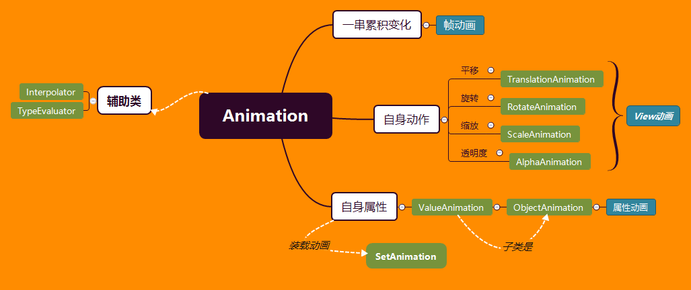
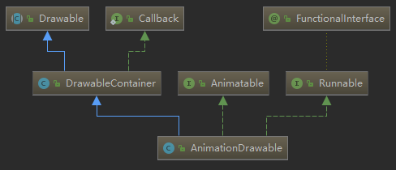

> 文章结构
>
> - 首先要明白有哪些动画场景？
> - 动画常用的工具介绍
> - 常见动画的案例
> - 自定义动画框架
> - 辅助类：paint、canvas


动画介绍与使用
--------------



动画分为三种：帧动画，View动画，属性动画

- 帧动画：由多个画面间隔固定的时间播放形成的一种动态场景，是堆积的一种效果

- View动画：View本身随着时间的动态变化，是一种主动的变化，但他并不改变实际的属性

- 属性动画：在短时时间内修改自身属性来达到的一种动态效果。

### 帧动画

xml 中注册资源

```xml
<?xml version="1.0" encoding="utf-8"?>
<animation-list xmlns:android="http://schemas.android.com/apk/res/android">
    <item android:drawable="@drawable/image1" />
    <item android:drawable="@drawable/image2" />
    <item android:drawable="@drawable/image3" />
</animation-list>
```

java 中使用

```java
Button btn = findViewById(R.id.btn_kevin);
btn.setBackgroundResource(R.drawable.kevin_frame_animation);
AnimationDrawable backAnimation = (AnimationDrawable) btn.getBackground();
backAnimation.start();
```

**源码分析** 

主要是看一下AnimationDrawable这个类



可以看到基础Drawable抽象类，以及DrawableContiainer，实现了Animatable类

还实现了Runnable接口，说明动画在子线程中执行

backAnimation.start()方法就是调用了子线程，不断的轮询播放图片，看一下具体代码

```java
@Override
public void start() {
    mAnimating = true;
    if (!isRunning()) {
        // Start from 0th frame.
        setFrame(0, false, mAnimationState.getChildCount() > 1
                 || !mAnimationState.mOneShot);
    }
}
@Override
public void run() {
    nextFrame(false);
}
```

查看一下setFrame和nextFrame方法

```java
// 简单的做了一个无线循环获取资源的操作。
private void nextFrame(boolean unschedule) {
    int nextFrame = mCurFrame + 1;
    final int numFrames = mAnimationState.getChildCount();
    final boolean isLastFrame = mAnimationState.mOneShot && nextFrame >= (numFrames - 1);
    // Loop if necessary. One-shot animations should never hit this case.
    if (!mAnimationState.mOneShot && nextFrame >= numFrames) {
        nextFrame = 0;
    }

    setFrame(nextFrame, unschedule, !isLastFrame);
}
// 使用CallBack 实现线程中资源的调度
private void setFrame(int frame, boolean unschedule, boolean animate) {
    if (frame >= mAnimationState.getChildCount()) {
        return;
    }
    mAnimating = animate;
    mCurFrame = frame;
    selectDrawable(frame);
    if (unschedule || animate) {
        unscheduleSelf(this);
    }
    if (animate) {
        // Unscheduling may have clobbered these values; restore them
        mCurFrame = frame;
        mRunning = true;
        scheduleSelf(this, 
                     SystemClock.uptimeMillis() + mAnimationState.mDurations[frame]);
    }
}
```


### View动画

总共是四种：TranslateAnimation、RotateAnimation、ScaleAnimation、AlphaAnimation

这四个类都是继承Animation，还有两个工具类：AnimationSet、AnimationUtils

View动画的实现其实就是不断的重新画图像，形成动画

AnimationSet动画容器的集合，AnimationUtils是用来加载动画xml配置文件

#### AnimationSet、Animationutils

```java
// AnimationSet的使用，其实容器
AnimationSet animationSet = new AnimationSet(false);
animationSet.addAnimation(animation);
btn.startAnimation(animationSet);
```

AnimationSet涉及到动画统一的播放，这里没有播放时间的差异，和插值器是否统一的区别

```java
// R.anim.kevin 是动画的配置文件
Animation animation = AnimationUtils.loadAnimation(this, R.anim.kevin);
btn.startAnimation(animation);
```

具体的配置文件参考

```xml
<?xml version="1.0" encoding="utf-8"?>
<set xmlns:android="http://schemas.android.com/apk/res/android"
    android:interpolator="@[package:]anim/interpolator_resource"
    android:shareInterpolator=["true" | "false"] >
    <alpha
        android:fromAlpha="float"
        android:toAlpha="float" />
    <scale
        android:fromXScale="float"
        android:toXScale="float"
        android:fromYScale="float"
        android:toYScale="float"
        android:pivotX="float"
        android:pivotY="float" />
    <translate
        android:fromXDelta="float"
        android:toXDelta="float"
        android:fromYDelta="float"
        android:toYDelta="float" />
    <rotate
        android:fromDegrees="float"
        android:toDegrees="float"
        android:pivotX="float"
        android:pivotY="float" />
    <set>
        ...
    </set>
</set>
```


#### 具体的使用

##### 设置动画

这里以TranslateAnimation为例，其他的也一样的方式

```java
TranslateAnimation translateAnimation = new TranslateAnimation(0, 100, 0, 100);
translateAnimation.setDuration(3000);
// 原路返回
translateAnimation.setRepeatMode(TranslateAnimation.REVERSE);
// 无限循环
translateAnimation.setRepeatCount(TranslateAnimation.INFINITE);
btn.startAnimation(translateAnimation);
```

也可以用xml去配置

```xml
<?xml version="1.0" encoding="utf-8"?>
<translate xmlns:android="http://schemas.android.com/apk/res/android"
           android:fillAfter="true"
           android:duration="3000"
           android:fromXDelta="50%"
           android:fromYDelta="50%"
           android:toXDelta="50%"
           android:toYDelta="50%">
</translate>
```

##### 动画监听

```java
translateAnimation.setAnimationListener(new Animation.AnimationListener() {
@Override
public void onAnimationStart(Animation animation) {}
@Override
public void onAnimationEnd(Animation animation) {}
@Override
public void onAnimationRepeat(Animation animation) {}
});
```

#### ViewGroup动画

就是用来对ViewGroup中的子view出现的动画作出定义，主要是通过**LayoutAnimationController** 来实现

这里以ListView为例

```java
ListView lvContainer = findViewById(R.id.lv_container);
AnimationSet set = new AnimationSet(true);
// 设置从无到有
set.addAnimation(new AlphaAnimation(0, 1));
// 设置从原有500px的地方出现并向原位置移动
set.addAnimation(new TranslateAnimation(500,0, 0,0));
// 设置子类出现的控制对象
LayoutAnimationController controller = new LayoutAnimationController(set);
controller.setDelay(0.5f);
controller.setOrder(LayoutAnimationController.ORDER_NORMAL);
lvContainer.setLayoutAnimation(controller);
// 开启动画
lvContainer.startLayoutAnimation();
```

ViewGroup 和 View 中的实现动画，其实都一样，只是统一的设置下面的View的动画

不是容器的View，都是调用requestLayout方法来实现，ViewGroup的实现，其实就是调用子类的requestLayout

#### Activity、Fragment出入动画

```

```


### 属性动画


### 自定义

#### 基本动画

#### 动画框架

