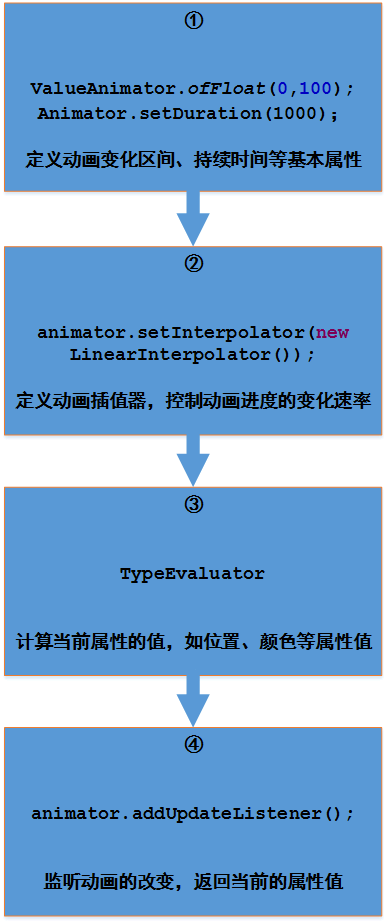
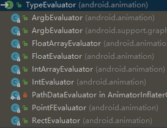

> 文章结构
>
> - 首先要明白有哪些动画场景？
> - 动画常用的工具介绍
> - 常见动画的案例
> - 自定义动画框架
> - 辅助类：paint、canvas


动画介绍与使用
--------------


动画分为三种：帧动画，View动画，属性动画

- 帧动画：由多个画面间隔固定的时间播放形成的一种动态场景，是堆积的一种效果

- View动画：View本身随着时间的动态变化，是一种主动的变化，但他并不改变实际的属性

- 属性动画：在短时时间内修改自身属性来达到的一种动态效果。

### 帧动画

xml 中注册资源

```xml
<?xml version="1.0" encoding="utf-8"?>
<animation-list xmlns:android="http://schemas.android.com/apk/res/android">
    <item android:drawable="@drawable/image1" />
    <item android:drawable="@drawable/image2" />
    <item android:drawable="@drawable/image3" />
</animation-list>
```

java 中使用

```java
Button btn = findViewById(R.id.btn_kevin);
btn.setBackgroundResource(R.drawable.kevin_frame_animation);
AnimationDrawable backAnimation = (AnimationDrawable) btn.getBackground();
backAnimation.start();
```

**源码分析** 

主要是看一下AnimationDrawable这个类


可以看到基础Drawable抽象类，以及DrawableContiainer，实现了Animatable类

还实现了Runnable接口，说明动画在子线程中执行

backAnimation.start()方法就是调用了子线程，不断的轮询播放图片，看一下具体代码

```java
@Override
public void start() {
    mAnimating = true;
    if (!isRunning()) {
        // Start from 0th frame.
        setFrame(0, false, mAnimationState.getChildCount() > 1
                 || !mAnimationState.mOneShot);
    }
}
@Override
public void run() {
    nextFrame(false);
}
```

查看一下setFrame和nextFrame方法

```java
// 简单的做了一个无线循环获取资源的操作。
private void nextFrame(boolean unschedule) {
    int nextFrame = mCurFrame + 1;
    final int numFrames = mAnimationState.getChildCount();
    final boolean isLastFrame = mAnimationState.mOneShot && nextFrame >= (numFrames - 1);
    // Loop if necessary. One-shot animations should never hit this case.
    if (!mAnimationState.mOneShot && nextFrame >= numFrames) {
        nextFrame = 0;
    }

    setFrame(nextFrame, unschedule, !isLastFrame);
}
// 使用CallBack 实现线程中资源的调度
private void setFrame(int frame, boolean unschedule, boolean animate) {
    if (frame >= mAnimationState.getChildCount()) {
        return;
    }
    mAnimating = animate;
    mCurFrame = frame;
    selectDrawable(frame);
    if (unschedule || animate) {
        unscheduleSelf(this);
    }
    if (animate) {
        // Unscheduling may have clobbered these values; restore them
        mCurFrame = frame;
        mRunning = true;
        scheduleSelf(this, 
                     SystemClock.uptimeMillis() + mAnimationState.mDurations[frame]);
    }
}
```


### View动画

总共是四种：TranslateAnimation、RotateAnimation、ScaleAnimation、AlphaAnimation

这四个类都是继承Animation，还有两个工具类：AnimationSet、AnimationUtils

View动画的实现其实就是不断的重新画图像，形成动画

AnimationSet动画容器的集合，AnimationUtils是用来加载动画xml配置文件

#### AnimationSet、Animationutils

```java
// AnimationSet的使用，其实容器
AnimationSet animationSet = new AnimationSet(false);
animationSet.addAnimation(animation);
btn.startAnimation(animationSet);
```

AnimationSet涉及到动画统一的播放，这里没有播放时间的差异，和插值器是否统一的区别

```java
// R.anim.kevin 是动画的配置文件
Animation animation = AnimationUtils.loadAnimation(this, R.anim.kevin);
btn.startAnimation(animation);
```

具体的配置文件参考

```xml
<?xml version="1.0" encoding="utf-8"?>
<set xmlns:android="http://schemas.android.com/apk/res/android"
    android:interpolator="@[package:]anim/interpolator_resource"
    android:shareInterpolator=["true" | "false"] >
    <alpha
        android:fromAlpha="float"
        android:toAlpha="float" />
    <scale
        android:fromXScale="float"
        android:toXScale="float"
        android:fromYScale="float"
        android:toYScale="float"
        android:pivotX="float"
        android:pivotY="float" />
    <translate
        android:fromXDelta="float"
        android:toXDelta="float"
        android:fromYDelta="float"
        android:toYDelta="float" />
    <rotate
        android:fromDegrees="float"
        android:toDegrees="float"
        android:pivotX="float"
        android:pivotY="float" />
    <set>
        ...
    </set>
</set>
```


#### 具体的使用

##### 设置动画

这里以TranslateAnimation为例，其他的也一样的方式

```java
TranslateAnimation translateAnimation = new TranslateAnimation(0, 100, 0, 100);
translateAnimation.setDuration(3000);
// 原路返回
translateAnimation.setRepeatMode(TranslateAnimation.REVERSE);
// 无限循环
translateAnimation.setRepeatCount(TranslateAnimation.INFINITE);
btn.startAnimation(translateAnimation);
```

也可以用xml去配置

```xml
<?xml version="1.0" encoding="utf-8"?>
<translate xmlns:android="http://schemas.android.com/apk/res/android"
           android:fillAfter="true"
           android:duration="3000"
           android:fromXDelta="50%"
           android:fromYDelta="50%"
           android:toXDelta="50%"
           android:toYDelta="50%">
</translate>
```

##### 动画监听

```java
translateAnimation.setAnimationListener(new Animation.AnimationListener() {
@Override
public void onAnimationStart(Animation animation) {}
@Override
public void onAnimationEnd(Animation animation) {}
@Override
public void onAnimationRepeat(Animation animation) {}
});
```

#### ViewGroup动画

就是用来对ViewGroup中的子view出现的动画作出定义，主要是通过**LayoutAnimationController** 来实现

这里以ListView为例

```java
ListView lvContainer = findViewById(R.id.lv_container);
AnimationSet set = new AnimationSet(true);
// 设置从无到有
set.addAnimation(new AlphaAnimation(0, 1));
// 设置从原有500px的地方出现并向原位置移动
set.addAnimation(new TranslateAnimation(500,0, 0,0));
// 设置子类出现的控制对象
LayoutAnimationController controller = new LayoutAnimationController(set);
controller.setDelay(0.5f);
controller.setOrder(LayoutAnimationController.ORDER_NORMAL);
lvContainer.setLayoutAnimation(controller);
// 开启动画
lvContainer.startLayoutAnimation();
```

ViewGroup 和 View 中的实现动画，其实都一样，只是统一的设置下面的View的动画

不是容器的View，都是调用requestLayout方法来实现，ViewGroup的实现，其实就是调用子类的requestLayout

#### Activity出入动画

看下一Activity的使用

```java
@Override
protected void onCreate(Bundle savedInstanceState) {
    super.onCreate(savedInstanceState);
    setContentView(R.layout.activity_main);
    startActivity(new Intent(MainActivity.this, SecondActivity.class));
    overridePendingTransition(R.anim.enter, R.anim.out);
}
@Override
public void finish() {
    super.finish();
    overridePendingTransition(R.anim.enter, R.anim.out);
}
```

看一下overridePendingTransition的源码，这里做一个猜想，其实进出动画就是在activity生命周期中进行了一个操作。

```java
public void overridePendingTransition(int enterAnim, int exitAnim) {
    try {
        // 发现这里调用了AMS的方法
        ActivityManager.getService().overridePendingTransition(
            mToken, getPackageName(), enterAnim, exitAnim);
    } catch (RemoteException e) {
    }
}
```

进入AMS中查看overridePendingTransition方法

```java
@Override
public void overridePendingTransition(IBinder token, String packageName,
                                      int enterAnim, int exitAnim) {
    synchronized(this) {
        ActivityRecord self = ActivityRecord.isInStackLocked(token);
        if (self == null) {return;}
        final long origId = Binder.clearCallingIdentity();
        if (self.isState(ActivityState.RESUMED, ActivityState.PAUSING)) {
            mWindowManager.overridePendingAppTransition(packageName,
                                                        enterAnim, exitAnim, null);
        }
        Binder.restoreCallingIdentity(origId);
    }
}
```

查看一下WindowManger中的overridePendingAppTransition

```java
@Override
public void overridePendingAppTransition(String packageName,
                                         int enterAnim, int exitAnim
                                         , IRemoteCallback startedCallback) {
    synchronized(mWindowMap) {
        mAppTransition.overridePendingAppTransition(packageName, enterAnim,
        exitAnim,startedCallback);
    }
}
```

查看一下AppTranslation

```java
// 注意这个方法的名字，意思是覆盖acvtivity原来的动画
void overridePendingAppTransition(String packageName, int enterAnim, int exitAnim,
                                  IRemoteCallback startedCallback) {
    if (canOverridePendingAppTransition()) {
        clear();
        mNextAppTransitionType = NEXT_TRANSIT_TYPE_CUSTOM;
        mNextAppTransitionPackage = packageName;
        mNextAppTransitionEnter = enterAnim;
        mNextAppTransitionExit = exitAnim;
        // 注意这里，这里进行了一个回调的处理
        postAnimationCallback();
        mNextAppTransitionCallback = startedCallback;
    }
}
```


### 属性动画


查看ValuesAnimation的源码，可以了解到

```java
/* This class provides a simple timing engine for running animations
* which calculate animated values and set them on target objects.
*/
为动画提供时间引擎的类，计算到动画的参数并设置到view对象中
```

Object是Values的子类，对作用对象进行了封装，同时也对一些使用的参数进行复写

TypeEvalutors：预估计算，TimeInterplator：时间差值器


#### ObjectAnimation

是对View的各种属性进行动画的设置：

```java
// 各种覆写
ObjectAnimator.ofArgb();	
ObjectAnimator.ofFloat();
ObjectAnimator.ofMultiFloat();
ObjectAnimator.ofObject();
ObjectAnimator.ofPropertyValuesHolder();
```

第一个参数一般是：View对象，第二个参数是：View的属性

```
alpha、backgroundColor、translateX、rotation等
```

[网上找了个例子](https://www.jianshu.com/p/85e407bec8aa)：

```java
// 三个动画的设置
ObjectAnimator alphaAnimator = ObjectAnimator.ofFloat(tvAlpha,"alpha",1f,0f,1f);
ObjectAnimator rotationAnimator = ObjectAnimator.ofFloat(tvAlpha,"rotation",0f,360f);
ObjectAnimator translateYAnimator =
    						ObjectAnimator.ofFloat(tvAlpha,"translationY",0f,700f,0f);
// 设置容器
AnimatorSet animatorSet = new AnimatorSet();
// 设置动画的播放的时间：在移动之前播放透明动画的同时播放旋转动画
animatorSet.play(alphaAnimator).with(rotationAnimator).before(translateYAnimator);
animatorSet.addListener(new AnimatorListenerAdapter() {
    @Override
    public void onAnimationEnd(Animator animation) {
        Log.e(TAG,"动画结束了");
    }
});
// 统一的设置持续的时间
animatorSet.setDuration(1000);
animatorSet.start();
```


#### TypeEvaluator、TimeInterpolator

这里先看一下张网图：



其实就是这样理解：属性动画，一个是时间的变化，一个是空间(属性值)的变化。

我们需要限定时间与属性值的变化范围，确定变化速率，组合属性不同的变化

##### TypeEvaluator

TypeEvaluator：<span style="background-color: #C6E2FF; padding:0px 3px; margin:2px; border-radius:3px ">是一个接口类，用来确定当前view的属性，比如颜色、位置</span>

```java
public interface TypeEvaluator<T> {
    public T evaluate(float fraction, T startValue, T endValue);
}
```



看一下子类：

```java
public class PointFEvaluator implements TypeEvaluator<PointF> {
    // PointF implements Parcelable
    // PointF 一个可以被序列化的类，用来记录当前的坐标位置
    private PointF mPoint;
    public PointFEvaluator() {}
    public PointFEvaluator(PointF reuse) {
        mPoint = reuse;
    }
    @Override
    public PointF evaluate(float fraction, PointF startValue, PointF endValue) {
        // fraction 是变化的百分比
        float x = startValue.x + (fraction * (endValue.x - startValue.x));
        float y = startValue.y + (fraction * (endValue.y - startValue.y));
        if (mPoint != null) {
            mPoint.set(x, y);
            return mPoint;
        } else {
            return new PointF(x, y);
        }
    }
}

```

##### TimeInterpolator

TimeInterpolator：<span style="background-color: #C6E2FF; padding:0px 3px; margin:2px; border-radius:3px ">定义了属性值变化的方式，如线性均匀改变，开始慢然后逐渐快等</span> 

看一下相关子类

```java
AccelerateInterpolator　　　　　   // 加速，开始时慢中间加速
DecelerateInterpolator　　　 　　  //减速，开始时快然后减速
AccelerateDecelerateInterolator　 //先加速后减速，开始结束时慢，中间加速
AnticipateInterpolator　　　　　　  //反向 ，先向相反方向改变一段再加速播放
 //反向加超越，先向相反方向改变，再加速播放，会超出目的值然后缓慢移动至目的值
AnticipateOvershootInterpolator
//跳跃，快到目的值时值会跳跃，如目的值100，后面的值可能依次为85，77，70，80，90，100
BounceInterpolator
// 循环，动画循环一定次数，值的改变为一正弦函数：Math.sin(2 * mCycles * Math.PI * input)
CycleIinterpolator　　　　　　　　  
LinearInterpolator　　　　　　　　  // 线性，线性均匀改变
OvershottInterpolator　　　　　　  //超越，最后超出目的值然后缓慢改变到目的值
TimeInterpolator　　　　　　　　　 // 一个接口，允许你自定义interpolator，以上几个都是实现了这个接口
```

看一下LinearInterpolator的源码，用来设定速度的匀速变化

```java
@HasNativeInterpolator
public class LinearInterpolator extends BaseInterpolator 
				implements NativeInterpolatorFactory {
    public LinearInterpolator() {}
    public LinearInterpolator(Context context, AttributeSet attrs) {}
    public float getInterpolation(float input) {
        return input;
    }
    @Override
    public long createNativeInterpolator() {
        return NativeInterpolatorFactoryHelper.createLinearInterpolator();
    }
}
```

使用

```java
Interpolator interpolator = new AccelerateDecelerateInterpolator();
animation.setInterpolator(interpolator);
```
