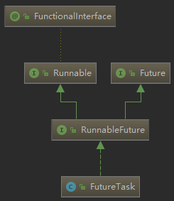

**应该从哪些方面分析来分析？？**

> 多线程的本质
>
> 生产者消费者模型
>
> 线程关键字的理解：volatile、synchronized
>
> 线程的实现方式与死锁
>
> 线程封装的使用类
>
> 开发中使用的线程：线程池

#### 本质理解

线程在各个层次的体现：

- 微机：某几段时钟的持有者，执行多个部分的机械指令
- 操作系统：TCB的表现者，在多个时间周期轮转中执行操作
- java层面：Thread对象，异步执行一个任务

一句话从本质上来说：<span style="background-color: #F9B6E5; padding:0px 3px; margin:2px; border-radius:3px ">多线程就是拥有多个时钟周期(计算机执行的周期)的权利</span> 

在微观上就是说，同一个任务分成多个部分交叉执行。

遇到问题是：<span style="background-color: #C6E2FF; padding:0px 3px; margin:2px; border-radius:3px ">共同需要做的数据如何处理？</span> 

先看一张图：


计算机运算的时间与人们的感官时间差距很大，所以有了多线程的概念

在每一个心跳中进行一次运算，这导致在操作系统分配时间轮转周期的时候，可能会打断程序员认为会一次进行的操作，这就是**原子性**操作

```java
i++;	// 这个在机器指令中分为：根据i的地址从内存读取i的值，将i进行加法运算，再赋值给i
```


#### 同步修饰词

|          |      synchronized      |     volatile     |
| :------: | :--------------------: | :--------------: |
| **使用** |   方法、变量、代码块   |       变量       |
| **作用** | 可见性、原子性、有序性 |      可见性      |
| **性能** |    可能造成线程阻塞    | 不会造成线程阻塞 |


#### 开启方式

先看一下继承关系，FunctionalInterface限制接口只能有一个抽象方法


发现java.lang.Thread类是实现了Runnable类

```java
public interface Runnable {
    // 在线程执行的时候调用此方法
    public abstract void run();
}
```

因此开启Thread的方法就有两种：

- 继承Thread类，复写run方法

  ```java
  public class MyThread extends Thread {
      @Override
      public void run() {
          super.run();
      }
  }
  ```

- 实现runnable接口，创建对象的时候传入

  ```java
  Thread t = new Thread(new Runnable() {
      @Override
      public void run() {
          // 这里用写需要跑的代码
      }
  });
  t.start();
  ```


#### 源码分析

看一下Runnable的代码

```java
@FunctionalInterface
public interface Runnable {
    // 实现这个接口，必须重写这个方法，但线程被调用的时候，这个方法就会被运行
    public abstract void run();
}
```

从最简单的使用来分析Thread的源码：

```java
Thread t = new Thread(new Runnable() {
    @Override
    public void run() {
        // 这里用写需要跑的代码
    }
});
t.start();
```

##### Thread()

- 先看一下创建线程的过程

  ```java
  public Thread(Runnable target) {
      init(null, target, "Thread-" + nextThreadNum(), 0);
  }
  // 看到这个方法有很多参数，可以知道Thread的创建重写了很多方法
  private void init(ThreadGroup g, Runnable target, String name, long stackSize) {
      // 调用native的方法currentThread()获取当前的线程
      Thread parent = currentThread();
      if (g == null) {
          g = parent.getThreadGroup();
      }
      g.addUnstarted();
      this.group = g;
      this.target = target;
      this.priority = parent.getPriority();
      // 是否是父级线程的守护线程
      this.daemon = parent.isDaemon();
      setName(name);
      init2(parent);
      // 指定JVM要开辟的栈的大小
      this.stackSize = stackSize;
      // 计算出下一个ThreadID，同时放回当前Thread的ID
      tid = nextThreadID();
  }
  ```

  总结来说，<span style="background-color: #C6E2FF; padding:0px 3px; margin:2px; border-radius:3px ">Thread的初始化设置了属性：线程组，父级线程，优先级，名字与ID，栈空间</span> 

- 这里再看一下**init2(parent)**

  ```java
  private void init2(Thread parent) {
      this.contextClassLoader = parent.getContextClassLoader();
      this.inheritedAccessControlContext = AccessController.getContext();
      // 当父类有局部变量的时候
      if (parent.inheritableThreadLocals != null) {
          // 注意ThreadLocal，用来储存主线程的局部变量
          this.inheritableThreadLocals = ThreadLocal.createInheritedMap(
              parent.inheritableThreadLocals);
      }
  }
  ```

##### Thread.strat()

```java
public synchronized void start() {
    // Android-changed: throw if 'started' is true
    // 当状态为初始0状态，没有启动的是跳过执行
    if (threadStatus != 0 || started)
        throw new IllegalThreadStateException();
    // 每一个线程都可能是一个group，这步操作是将其加入上一个group数组中
    group.add(this);
    started = false;
    try {
        nativeCreate(this, stackSize, daemon);
        // 记录开启，标志不能重复开启
        started = true;
    } finally {
        try {
            if (!started) {
                // 在group数组进行移除当前线程，同时记录移除操作。
                group.threadStartFailed(this);
            }
        } catch (Throwable ignore) {
        }
    }
}
```

实际的创建时在c中，**nativeCreate()** ，用everthing软件搜索**java_lang_Thread.cc**(jdk中类，一般是以java_lang开头后面加类名)，我这边的路径是：<span style="display: inline-block;border:1px solid #dbdcdc; background:#f5f5f5; padding-right: 3px ; margin:3px; border-radius: 3px " >android-8.0.0_r1\art\runtime\native</span> 

```c++
// java_thread :java中的Thread对象
static void Thread_nativeCreate(JNIEnv* env, jclass, jobject java_thread, 
                                jlong stack_size,jboolean daemon) {
  // There are sections in the zygote that forbid thread creation.
  Runtime* runtime = Runtime::Current();
  if (runtime->IsZygote() && runtime->IsZygoteNoThreadSection()) {
    jclass internal_error = env->FindClass("java/lang/InternalError");
    CHECK(internal_error != nullptr);
    env->ThrowNew(internal_error, "Cannot create threads in zygote");
    return;
  }
  // 注意这里调用了thread.cc的代码
  Thread::CreateNativeThread(env, java_thread, stack_size, daemon == JNI_TRUE);
}
```

查看一下**thread.cc**，中的CreateNativeThread方法（thread.cc与java_lang_Thread.cc在同一个文件夹)

```c++
// java_peer：就是java的对象实例
void Thread::CreateNativeThread(JNIEnv* env, jobject java_peer, 
                                size_t stack_size, bool is_daemon) {
  CHECK(java_peer != nullptr);
  Thread* self = static_cast<JNIEnvExt*>(env)->self;
    ...
  Runtime* runtime = Runtime::Current();

  // Atomically start the birth of the thread ensuring the runtime isn't shutting down.
    ...
  Thread* child_thread = new Thread(is_daemon);
  // Use global JNI ref to hold peer live while child thread starts.
  child_thread->tlsPtr_.jpeer = env->NewGlobalRef(java_peer);
  stack_size = FixStackSize(stack_size);

  // Thread.start is synchronized, so we know that nativePeer is 0, and know that we're not racing to
  // assign it.
  env->SetLongField(java_peer, WellKnownClasses::java_lang_Thread_nativePeer,
                    reinterpret_cast<jlong>(child_thread));

  // Try to allocate a JNIEnvExt for the thread. We do this here as we might be out of memory and
  // do not have a good way to report this on the child's side.
    ...
  int pthread_create_result = 0;
  if (child_jni_env_ext.get() != nullptr) {
    pthread_t new_pthread;
    pthread_attr_t attr;
    child_thread->tlsPtr_.tmp_jni_env = child_jni_env_ext.get();
    CHECK_PTHREAD_CALL(pthread_attr_init, (&attr), "new thread");
    CHECK_PTHREAD_CALL(pthread_attr_setdetachstate, (&attr, PTHREAD_CREATE_DETACHED),
                       "PTHREAD_CREATE_DETACHED");
    CHECK_PTHREAD_CALL(pthread_attr_setstacksize, (&attr, stack_size), stack_size);
     // 注意看这里！！！！！！！！！！！！！！
    pthread_create_result = pthread_create(&new_pthread,
                                           &attr,
                                           Thread::CreateCallback,
                                           child_thread);
    CHECK_PTHREAD_CALL(pthread_attr_destroy, (&attr), "new thread");

    if (pthread_create_result == 0) {
      // pthread_create started the new thread. 
      // The child is now responsible for managing the
      // JNIEnvExt we created.
      // Note: we can't check for tmp_jni_env == nullptr, as that would require synchronization
      //       between the threads.
      child_jni_env_ext.release();
      return;
    }
  }

  // Either JNIEnvExt::Create or pthread_create(3) failed, so clean up.
    ...
  // Manually delete the global reference since Thread::Init will not have been run.
    ...
  // TODO: remove from thread group?
    ...
}
```

这里可以发现，最终调用的是**pthread**库中的方法，进行创建，这个是linux自带的


##### sleep() 与 jion()


##### yield() 与 interrupt()




#### 辅助类

##### ThreadLocal


#### Thread设计总结


#### 生产者消费者