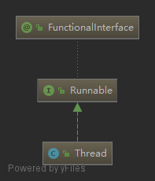

**应该从哪些方面分析来分析？？**

> 多线程的本质
>
> 生产者消费者模型
>
> 线程关键字的理解：volatile、synchronized
>
> 线程的实现方式与死锁
>
> 线程封装的使用类
>
> 开发中使用的线程：线程池


先看一下java中如何开启线程

```

```


#### 同步修饰词

先简单的了解一下线程同步的关键字，下面再做仔细的分析

```java
synchronized
volatile
```

两者比较：

- 使用
  - synchronized：可以修饰方法与变量
  - volatile：只能修饰变量
- 作用
  - synchronized：可以保证可见性，又能够保证原子性、有序性
  - volatile：能保证可见性，但不能保证原子性，但性能更优。
  - volatile不会造成线程阻塞，synchronized可能会造成线程阻塞。

可见性，比如volatile可以保证当在一个线程修改后，能保证所有的线程可以获取到最新的值



看一下Runnable的代码

```java
@FunctionalInterface
public interface Runnable {
    // 实现这个接口，必须重写这个方法，但线程被调用的时候，这个方法就会被运行
    public abstract void run();
}
```

从最简单的使用来分析Thread的源码：

```java
Thread t = new Thread(new Runnable() {
    @Override
    public void run() {
        // 这里用写需要跑的代码
    }
});
t.start();
```

先看一下创建线程的过程

```java
public Thread(Runnable target) {
    init(null, target, "Thread-" + nextThreadNum(), 0);
}
// 看到这个方法有很多参数，可以知道Thread的创建重写了很多方法
private void init(ThreadGroup g, Runnable target, String name, long stackSize) {
    // 调用native的方法currentThread()获取当前的线程
    Thread parent = currentThread();
    if (g == null) {
        g = parent.getThreadGroup();
    }
    g.addUnstarted();
    this.group = g;
    this.target = target;
    this.priority = parent.getPriority();
    // 是否是父级线程的守护线程
    this.daemon = parent.isDaemon();
    setName(name);
    init2(parent);
    // 指定JVM要开辟的栈的大小
    this.stackSize = stackSize;
    // 计算出下一个ThreadID，同时放回当前Thread的ID
    tid = nextThreadID();
}
```

总结来说，<span style="background-color: #C6E2FF; padding:0px 3px; margin:2px; border-radius:3px ">Thread的初始化设置了属性：线程组，父级线程，优先级，名字与ID，栈空间</span> 

这里再看一下**init2(parent)**

```java
private void init2(Thread parent) {
    this.contextClassLoader = parent.getContextClassLoader();
    this.inheritedAccessControlContext = AccessController.getContext();
    if (parent.inheritableThreadLocals != null) {
        this.inheritableThreadLocals = ThreadLocal.createInheritedMap(
            parent.inheritableThreadLocals);
    }
}
```

